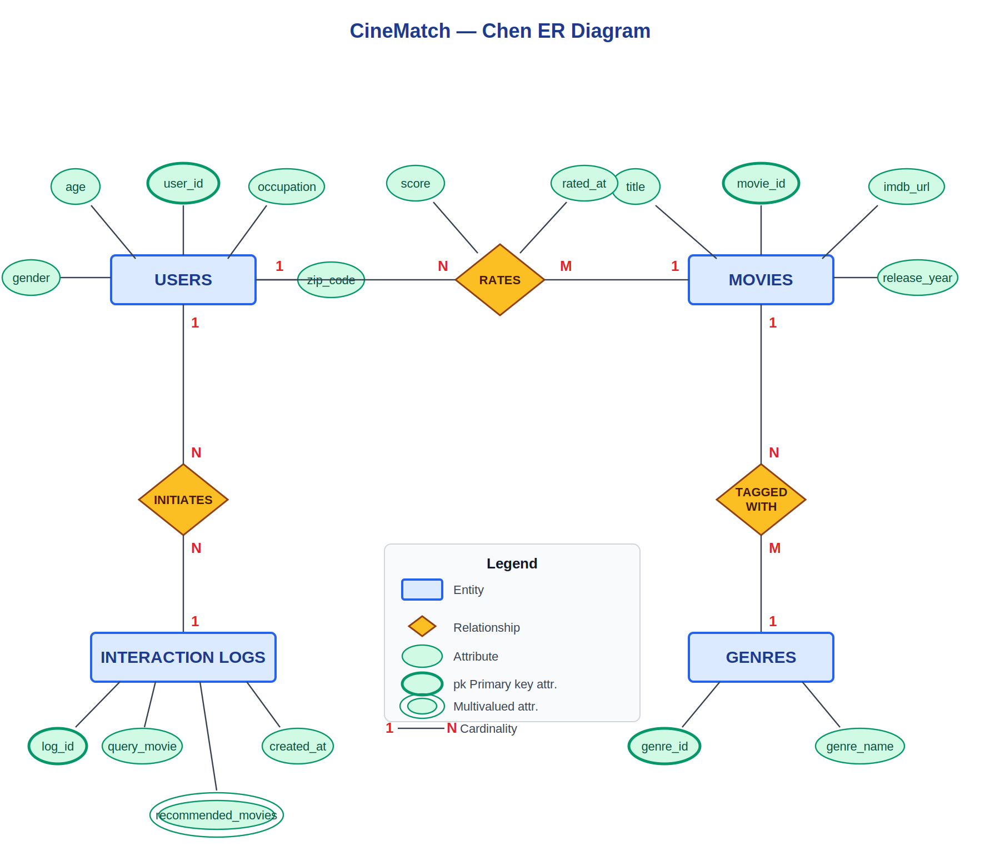
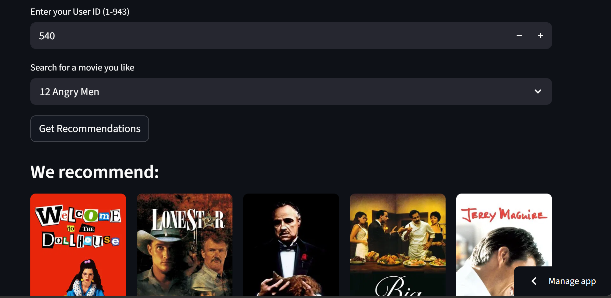
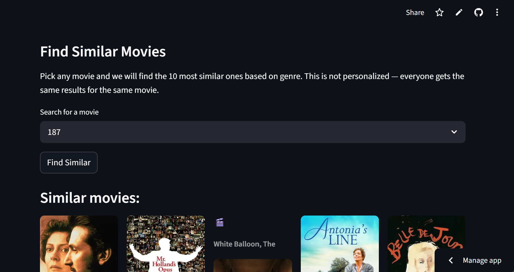

# CineMatch: Database Design and Integration for an AI-Powered Movie Recommendation System

**FAST NUCES — Database Systems**
Instructor: Mr. Talha Shahid
Submission Date: May 8, 2026

| Name | ID |
|---|---|
| Tayaba | 24K-0934 |
| Wardah Ahmed | 24K-1045 |

> **Note:** This project is a combined submission integrating the Database Systems course with the Artificial Intelligence course. Humna Fatime (23K-1016) is part of the CineMatch AI team but does not take the Database Systems course and is therefore not included in this submission.

---

## 1. Project Overview

CineMatch is an AI-powered movie recommendation system originally developed as part of the Artificial Intelligence course. The system uses content-based filtering, collaborative filtering, SVD, and a hybrid recommendation algorithm to suggest personalized movies to users. For the Database Systems course, the project extended CineMatch by designing and implementing a proper relational database backend that replaces the flat-file data storage previously used.

The database stores all movie metadata, user information, ratings, genres, and interaction logs in a normalized relational schema. It was implemented using SQLite, with a design compatible with PostgreSQL for production deployment. The Python application interacts with the database using the built-in sqlite3 library, and all core queries are written in standard SQL. The full implementation was completed and tested end-to-end using the MovieLens 100K dataset.

---

## 2. Implemented Database Schema

The final database consists of six tables organized in a normalized relational structure. The schema is in Third Normal Form (3NF) to eliminate redundancy and ensure data integrity. The ER diagram is included in Section 3.

### 2.1 Tables Overview

| Table | Primary Key | Key Columns | Purpose |
|---|---|---|---|
| users | user_id | age, gender, occupation, zip_code | Stores user profiles from MovieLens |
| movies | movie_id | title, release_year, imdb_url | Stores movie information |
| genres | genre_id | genre_name | Lookup table for all 19 genre categories |
| movie_genres | movie_id + genre_id | movie_id (FK), genre_id (FK) | Many-to-many: movies to genres |
| ratings | rating_id | user_id (FK), movie_id (FK), score, rated_at | All user ratings on a scale of 1 to 5 |
| interaction_logs | log_id | user_id (FK), query_movie, recommended_movies, created_at | Logs every recommendation request |

### 2.2 Relationships

- **One user → many ratings (one-to-many).** This is the core relationship for collaborative filtering: the ratings table is the bridge between users and movies, and all similarity computations are derived from it.
- **One movie → many ratings (one-to-many).** Movies with fewer than a threshold number of ratings are treated as cold-start items; this count is directly queryable using GROUP BY and HAVING.
- **Movies ↔ Genres (many-to-many, resolved via movie_genres).** Separating genres into a lookup table eliminates the repeating binary-flag columns in the raw MovieLens CSV and brings the schema into 1NF.
- **One user → many interaction logs (one-to-many).** The interaction_logs table is the only persistent record of what the system actually recommended, which had no equivalent in the original flat-file implementation.
- **Foreign key constraints use ON DELETE CASCADE.** Removing a user automatically removes their ratings and interaction logs, preventing orphaned rows.

### 2.3 Indexing

Three indexes were created on the performance-critical ratings table (100,000 rows):

- `idx_ratings_user_id` on ratings(user_id) — supports user rating history lookups and collaborative filtering joins
- `idx_ratings_movie_id` on ratings(movie_id) — supports per-movie average rating queries
- `idx_movie_genres_movie_id` on movie_genres(movie_id) — supports genre-based filtering joins

---

## 3. ER Diagram

The Chen-notation ER diagram below shows four primary entities (USERS, MOVIES, GENRES, INTERACTION_LOGS) connected by three relationships: RATES (USERS–MOVIES, cardinality 1:N on the user side and 1:M on the movie side, with score and rated_at as relationship attributes), TAGGED WITH (MOVIES–GENRES, cardinality N:M resolved by the movie_genres junction table), and INITIATES (USERS–INTERACTION_LOGS, cardinality 1:N). The recommended_movies attribute on INTERACTION_LOGS is modeled as a multivalued attribute since a single log entry stores a comma-separated list of recommended titles.

*Figure 1: CineMatch Chen-Notation ER Diagram*

---

## 4. Data Population

The database was populated from the MovieLens 100K dataset. Raw CSV files were read into pandas DataFrames and inserted using a combination of pandas `to_sql` and `cursor.executemany`. The movie_genres table was populated by iterating over the 19 binary genre flag columns in the movies CSV, mapping each flagged column to a (movie_id, genre_id) pair and inserting it into the junction table. Final row counts after population:

| Table | Rows Inserted |
|---|---|
| users | 943 |
| movies | 1,682 |
| genres | 19 |
| movie_genres | 2,893 |
| ratings | 100,000 |
| interaction_logs | 0 (populated at runtime) |

---

## 5. SQL Queries and Results

### 5.1 Query Summary

| # | Query | Concepts Used |
|---|---|---|
| 1 | Top 10 highest rated movies (min 50 ratings) | JOIN, GROUP BY, HAVING, AVG, ORDER BY |
| 2 | Rating history for a specific user | JOIN, WHERE, ORDER BY |
| 3 | Genre-based movie search | JOIN, WHERE |
| 4 | Top 10 most active users | JOIN, GROUP BY, COUNT, AVG, ORDER BY |
| 5 | Genre popularity by movie count | JOIN, GROUP BY, COUNT, ORDER BY |
| 6 | Average rating per genre | JOIN, GROUP BY, AVG, ORDER BY |
| 7 | Cold-start recommendations for new users | GROUP BY, HAVING, AVG, ORDER BY |
| 8 | Movies liked by users similar to a target user | Nested subqueries, JOIN, GROUP BY, COUNT |

### 5.2 Selected Query Results

**Query 1 — Top 10 Highest Rated Movies (minimum 50 ratings)**

| Title | Avg Rating | Total Ratings |
|---|---|---|
| Close Shave, A (1995) | 4.49 | 112 |
| Wrong Trousers, The (1993) | 4.47 | 118 |
| Schindler's List (1993) | 4.47 | 298 |
| Casablanca (1942) | 4.46 | 243 |
| Shawshank Redemption, The (1994) | 4.45 | 283 |
| Wallace & Gromit: The Best of Aardman Animation (1996) | 4.45 | 67 |
| Usual Suspects, The (1995) | 4.39 | 267 |
| Rear Window (1954) | 4.39 | 209 |
| Star Wars (1977) | 4.36 | 583 |
| 12 Angry Men (1957) | 4.34 | 125 |

**Query 4 — Top 10 Most Active Users**

| User ID | Occupation | Total Ratings | Avg Rating |
|---|---|---|---|
| 405 | healthcare | 737 | 1.83 |
| 655 | healthcare | 685 | 2.91 |
| 13 | educator | 636 | 3.10 |
| 450 | educator | 540 | 3.86 |
| 276 | student | 518 | 3.47 |
| 416 | student | 493 | 3.85 |
| 537 | engineer | 490 | 2.87 |
| 303 | student | 484 | 3.37 |
| 234 | retired | 480 | 3.12 |
| 393 | student | 448 | 3.34 |

**Query 5 — Genre Popularity by Number of Movies**

| Genre | Movie Count |
|---|---|
| Drama | 725 |
| Comedy | 505 |
| Thriller | 251 |
| Action | 251 |
| Romance | 247 |
| Adventure | 135 |
| Childrens | 122 |
| Crime | 109 |
| SciFi | 101 |
| Horror | 92 |

**Query 6 — Average Rating by Genre**

| Genre | Avg Rating | Total Ratings |
|---|---|---|
| FilmNoir | 3.92 | 1,733 |
| War | 3.82 | 9,398 |
| Drama | 3.69 | 39,895 |
| Documentary | 3.67 | 758 |
| Mystery | 3.64 | 5,245 |
| Crime | 3.63 | 8,055 |
| Romance | 3.62 | 19,461 |
| Comedy | 3.39 | 29,832 |
| Horror | 3.29 | 5,317 |
| Fantasy | 3.22 | 1,352 |

**Query 7 — Cold-Start Recommendations (minimum 100 ratings)**

| Title | Avg Rating | Total Ratings |
|---|---|---|
| Close Shave, A (1995) | 4.49 | 112 |
| Schindler's List (1993) | 4.47 | 298 |
| Wrong Trousers, The (1993) | 4.47 | 118 |
| Casablanca (1942) | 4.46 | 243 |
| Shawshank Redemption, The (1994) | 4.45 | 283 |
| Usual Suspects, The (1995) | 4.39 | 267 |
| Rear Window (1954) | 4.39 | 209 |
| Star Wars (1977) | 4.36 | 583 |
| 12 Angry Men (1957) | 4.34 | 125 |
| Silence of the Lambs, The (1991) | 4.29 | 390 |

**Query 8 — Movies Liked by Users Similar to User 1**

| Title | Liked by Similar Users | Avg Score |
|---|---|---|
| E.T. the Extra-Terrestrial (1982) | 25 | 4.56 |
| One Flew Over the Cuckoo's Nest (1975) | 25 | 4.56 |
| Schindler's List (1993) | 22 | 4.77 |
| Casablanca (1942) | 22 | 4.68 |
| Rear Window (1954) | 21 | 4.52 |
| To Kill a Mockingbird (1962) | 20 | 4.55 |
| Scream (1996) | 20 | 4.55 |
| Gandhi (1982) | 20 | 4.35 |

---

## 6. Interaction Logging

The interaction_logs table was populated at runtime by logging a sample recommendation request. User 1 queried the system using Toy Story (1995) as the input movie. The five recommended movies recorded in the log were: Schindler's List (1993), Casablanca (1942), One Flew Over the Cuckoo's Nest (1975), E.T. the Extra-Terrestrial (1982), and Rear Window (1954). The log captured the user_id, query_movie, recommended_movies as a comma-separated string, and a created_at timestamp of 2026-05-08 11:23:51. This confirms that the interaction_logs table functions correctly as a persistent audit trail for recommendation events, replacing the complete absence of such logging in the original flat-file system.

---

## 7. Technology Stack

| Component | Technology | Purpose |
|---|---|---|
| Database | SQLite 3 | Lightweight relational database, no server required |
| Production DB | PostgreSQL 14+ | Production-ready deployment option |
| Language | Python 3.13 | Database interaction and data population scripts |
| DB Library | sqlite3 (built-in) | Python interface for SQLite |
| Data Library | pandas, NumPy | CSV loading, DataFrame manipulation, bulk inserts |
| Data Source | MovieLens 100K | Source dataset for populating the database |
| ORM | None (raw SQL) | All queries written in standard SQL |
| Notebook | Jupyter (ipykernel) | Implementation and query demonstration environment |
| Integration | FastAPI + SQLite | Database connected to the CineMatch REST API |

---

## 8. Frontend

The Streamlit frontend provides two user-facing features. Get Recommendations takes a user ID and a movie selection and returns 10 personalized recommendations as a poster grid with TMDB ratings. Find Similar Movies returns 10 genre-similar movies for any selected title and is not personalized.

*Figure 2: Get Recommendations — User ID input and movie selection*

*Figure 3: Personalized recommendation results displayed as a poster grid*

*Figure 4: Find Similar Movies — Genre-based search*

---

## 9. Key Observations

The data population step revealed several details about the MovieLens dataset not visible when loading from CSV. Drama is the most represented genre at 725 movies, more than double Comedy at 505. Genre popularity by movie count does not mirror quality: Film Noir has the highest average rating at 3.92 despite covering only 24 movies, while Comedy ranks near the bottom at 3.39. User 405 is the most active user with 737 ratings but holds the lowest average of 1.83 among the top ten, suggesting systematically low scoring. The cold-start query at 100 minimum ratings produced a more trusted list than the top-rated query at 50, with Schindler's List, Casablanca, and Shawshank Redemption appearing in both.

---

## 10. Conclusion

The CineMatch database was successfully designed, implemented, and populated from the MovieLens 100K dataset. The six-table normalized schema correctly captures all entities and relationships required by the hybrid recommendation system. All eight SQL queries executed correctly and returned meaningful, verifiable results. The interaction logging system was demonstrated end-to-end by recording a live recommendation request. The database layer provides persistent structured storage that the original CSV-based system entirely lacked, enabling SQL queries over 100,000 ratings without loading full matrices into memory and maintaining a durable log of every recommendation event. Future work would replace the in-memory matrix lookups in the FastAPI routes with direct SQL queries, completing the full database-backed deployment described in the project proposal.

---

## 11. Team & Responsibilities

| Member | ID | DB Responsibilities |
|---|---|---|
| Tayaba | 24K-0934 | Schema design, ER diagram, data population scripts |
| Wardah Ahmed | 24K-1045 | SQL queries, FastAPI database integration, project report |